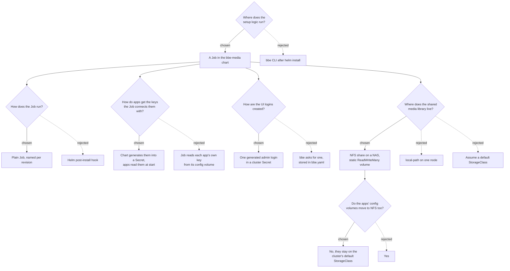

# 0001: Connecting the media apps on install

**Status:** accepted, 2026-09-24

## Context

`bbe-media` installs Sonarr, Radarr, Prowlarr, Bazarr, Jellyfin and Jellyseerr, and now qBittorrent. Until now every app started unconfigured. Each one asked for its own login on the first visit and generated its own API key, and the user then had to copy keys between six web UIs to connect them. Two things made that worse:

- qBittorrent 4.6.1 and later print a new temporary password on every start until one is set, so there was no stable login to give Sonarr and Radarr.
- Each chart created its own media volume, so a file qBittorrent downloaded couldn't be seen by Sonarr, and one Sonarr imported couldn't be seen by Jellyfin.

The goal: after `bbe install`, every app is connected, and the user is left with only what bbe can't know: which indexers to use.

## Decision tree



## Decisions

### 1. The setup runs as a Job inside the chart

A Job in `bbe-media` waits for the apps, then configures them through their HTTP APIs. It runs inside the cluster, so it reaches every app by its service name and reads the Secrets directly. It also works for anyone installing with plain `helm install`.

Rejected: doing it from the bbe CLI after `helm install`. The CLI would need to reach every pod from the user's machine through port-forwards, the logic would live in a different repository from the charts it depends on, and it would only work through bbe.

### 2. The Job is a plain Job named after the release revision

`bbe-media-setup-<revision>` is a normal resource of the release. A new revision gets a new Job, so every upgrade sets the apps up again, and Helm removes the previous one.

Rejected: a `post-install,post-upgrade` hook. Helm waits for hooks to finish and fails the whole install after `--timeout`, 5 minutes by default. A first install pulls seven images and waits for Jellyfin's first start, which can take longer than that on a small node. As a plain Job, it retries on its own (`bbe.setup.backoffLimit`) while `helm install` returns straight away.

### 3. API keys are generated by the chart and handed to the apps at start

`templates/secrets.yaml` generates a key per app into `bbe-media-api-keys`, and reads the existing ones back with `lookup` on upgrades, so a key never changes after the first install. Each app is then started with its key:

| App | How it reads the key |
|---|---|
| Sonarr, Radarr, Prowlarr | `<APP>__AUTH__APIKEY`: these apps bind their `Auth` settings from environment variables (`Bootstrap.cs`) |
| Bazarr | `DYNACONF_AUTH__APIKEY`: Bazarr loads its settings with Dynaconf 3.2, which reads `DYNACONF_` overrides |

The Job gets the same keys from the same Secret, so it never has to discover them.

Rejected: letting each app generate its key and having the Job read it from the app's config volume. Those volumes are `ReadWriteOnce`, so the Job would have to run on the same node as every app, and it would have to parse four config formats.

The app charts' env schemas now allow `valueFrom`, which is what lets `bbe-media` pass keys as `secretKeyRef`s rather than as plain text in its values.

### 4. One generated admin login for every UI

`bbe-media-admin` holds a username (`bbe.admin.username`, default `admin`) and a 24-character password generated on the first install and kept on upgrades. The Job sets it as the login of Sonarr, Radarr, Prowlarr and Bazarr, and creates it as Jellyfin's first administrator. Jellyseerr's admin is the same account, as it signs in through Jellyfin. qBittorrent's chart writes it into `qBittorrent.conf` before qBittorrent starts (`qbittorrent.webui.existingSecret`), hashed with PBKDF2-SHA512 like qBittorrent itself.

The chart's notes print the command to read the password. Nothing secret ends up in `bbe.yaml`, which bbe syncs to S3 when AWS storage is on.

Rejected: having bbe ask for the login and store it in `bbe.yaml`. It would be plain text in a file that leaves the machine.

### 5. The media library is an NFS share

The user gives an NFS server and path (`bbe.media.nfs`). They're required values, so bbe asks for them. The chart creates a static `ReadWriteMany` volume for that share and one claim, `bbe-media-library`, and every app mounts it at `/media`:

```
/media/downloads   qBittorrent saves here
/media/tv          Sonarr's root folder, Jellyfin's Shows library
/media/movies      Radarr's root folder, Jellyfin's Movies library
```

The same path in every app means Sonarr and Radarr move finished downloads instead of copying them, and no app needs a path mapping. The volume's reclaim policy is `Retain`, and deleting a static NFS volume never touches the share's data.

Rejected: local-path on one node, which ties every media app and the library to that node's disk. Assuming a default StorageClass was also rejected: bbe clusters don't have one, and a `ReadWriteOnce` volume would still need every app on one node.

Talos mounts NFS through its kubelet image. NFSv3 needs `nolock` there, as Talos runs no lock daemon, so the default is `nfsvers=4.1`.

### 6. Config volumes stay off NFS

Every app keeps a SQLite database in its config volume, and SQLite over NFS is a known cause of corruption. The Servarr apps warn against it outright. Config volumes keep using the cluster's default StorageClass.

## What the Job sets up

Every step reads the current state first, so a second run only updates bbe's own connections and adds nothing twice. The connections are found again by name: `qBittorrent` in Sonarr and Radarr, `Sonarr` and `Radarr` in Prowlarr.

| App | Set up |
|---|---|
| qBittorrent | Saves downloads to `/media/downloads` |
| Sonarr, Radarr | Admin login, root folder, qBittorrent as download client |
| Prowlarr | Admin login, Sonarr and Radarr as applications with full sync |
| Bazarr | Admin login, connected to Sonarr and Radarr |
| Jellyfin | Startup wizard with the admin account, Shows and Movies libraries |
| Jellyseerr | Signed in through Jellyfin, libraries enabled, Sonarr and Radarr connected with the HD-1080p profile when it exists |

Left to the user: adding indexers in Prowlarr. They depend on which sites someone uses, and Prowlarr pushes them to Sonarr and Radarr from there.

## Consequences

- **Config storage is still a prerequisite.** A bbe cluster has no default StorageClass, so the config volumes stay `Pending` until one exists. That needs its own decision: for example a local-path provisioner installed by bbe.
- **The NFS export must let the apps write.** The apps run as root by default, so the export needs `no_root_squash`, or `all_squash` mapped to the share's owner.
- **Changing the NFS server or path after installing fails the upgrade**, as a volume's source can't be changed. Uninstall and install again instead. The media stays on the share.
- **Changing `bbe.admin.username` after installing** updates every app except Jellyfin and Jellyseerr, whose accounts are created once.
- **Older bbe versions can't install this chart version**, as they can't ask for the required NFS values. `required-versions.yaml` has to raise `bbe-media`'s `min-bbe-cli` to the first bbe release that can.
- **Verified against real apps:** Sonarr 4.0.20, Radarr 6.4.4, Prowlarr 2.6.5, qBittorrent 5.2.3 and Jellyfin 10.11.11 ran natively, with the Job's script run twice against them. Bazarr 1.6.1 and Jellyseerr 2.7.3 couldn't be started there. Their steps follow their source and were run against stubs, so the first real install is their first real test.
